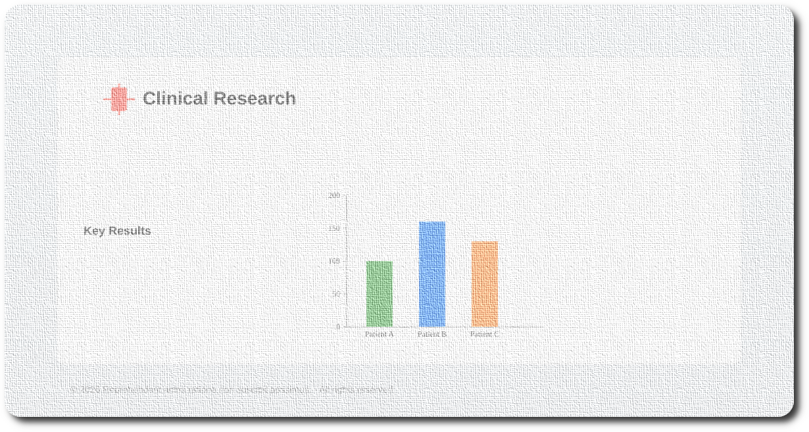

# `research-health-project`



## scaffolding

Maven:

**docker-compose** optional dependencies.

```shell
cd ~/Workshop/Projects/spring-boot-projects/
curl --verbose --get https://start.spring.io/
curl --verbose \
  --data dependencies=web,graphql,data-jpa,h2,lombok,spring-restclient,actuator,devtools \
  --data language=java \
  --data bootVersion=4.0.6 \
  --data type=maven-project \
  --data javaVersion=17 \
  --data groupId=local.health \
  --data artifactId=research \
  --data configurationFileFormat=yaml \
  --output research.zip \
  --get https://start.spring.io/starter.zip
ls -l research.zip
file research.zip
unzip -q research.zip -d ./research-health-project
cd ./research-health-project/
java --version
./mvnw spring-boot:run
```

---

## initialize local repository

Then give the following commands:

```shell
ls -al
git init
git branch -m main
git status
git add .
git status
git config user.email "developer@research.health.local"
git config user.name "developer"
git commit -m "initializing the local repository"
git tag -a v0.0.0 -m "starting version of clean repo"
git log
git checkout -b staging
git merge --no-ff main -m "merge main into staging"
git checkout -b draft
git merge --no-ff main -m "merge main into draft"
git status
git log
git branch --list | wc -l
git branch --list
```

And, after each change, the cycle repeats:

```shell
git status
git add .
git commit -m "further adjustments"
git tag -a v0.0.1 -m "further adjustments"
git log
git checkout staging
git merge --no-ff draft -m "merge draft into staging"
git checkout main
git merge --no-ff staging -m "merge staging into main"
git checkout draft
```

Or, grouping the last commands:

```shell
git add . && git commit -m "further adjustments" && git tag -a v0.0.1 -m "further adjustments"
git checkout staging && git merge --no-ff draft -m "merge draft into staging" && git checkout main && git merge --no-ff staging -m "merge staging into main" && git checkout draft
```

To see, for example, the last three commits:

```shell
git log -3
```

If something were to go wrong:

```shell
git reset --hard v0.0.0
```

To remove, after modifying file `gitignore` , for example, a directory from change tracking but not from the filesystem:

```shell
git rm -r --cached data/
git commit -m "Remove data directory from tracking"
git tag -a v0.0.2 -m "remove data directory from tracking"
```

---

## example settings for the `vscode` code editor and similar

Example of `.vscode/settings.json`:

```json
{
  "java.jdt.ls.java.home": "/home/developer_username/.opt/Java/jdk-17.0.18+8",
  "java.configuration.runtimes": [
    {
      "name": "JavaSE-17",
      "path": "/home/developer_username/.opt/Java/jdk-17.0.18+8",
      "default": true
    },
    {
      "name": "JavaSE-21",
      "path": "/home/developer_username/.opt/Java/jdk-21.0.10+7"
    },
    {
      "name": "JavaSE-25",
      "path": "/home/developer_username/.opt/Java/jdk-25.0.2+10"
    },
    {
      "name": "JavaSE-26",
      "path": "/home/developer_username/.opt/Java/jdk-26+35"
    }
  ],
  "java.configuration.updateBuildConfiguration": "interactive",
  "java.compile.nullAnalysis.mode": "automatic"
}
```

---

## images

I generated the images for this project by first creating SVG code and then converting it to other formats using only open-source and free software:

```shell
convert -background none research-1200x627.png -resize 64x64 favicon-64.png && \
convert -background none research-1200x627.png -resize 48x48 favicon-48.png && \
convert -background none research-1200x627.png -resize 32x32 favicon-32.png && \
convert -background none research-1200x627.png -resize 16x16 favicon-16.png && \
convert favicon-16.png favicon-32.png favicon-48.png favicon-64.png favicon.ico && \
rm favicon-16.png favicon-32.png favicon-48.png favicon-64.png
```

and simply:

```shell
convert -background none research-1200x627.png -resize 64x64 research-64.png
```

## how to test endpoint from shell thanks `cURL` and `HTTPie`

First, from a shell, execute the following commands:

```shell
cd project/path/research-health-project/logs
tail --follow --lines=100 app.log
```

In a new shell:

```shell
cd project/path/research-health-project
./mvnw spring-boot:run
```

Now I need to open another shell from where I can send commands to test the GraphQL API.

**The following contains names, titles and other material that are purely fictitious and do not refer to anyone or anything, but are for illustrative and testing purposes only.**

### articles

Read all articles with cURL:

```bash
curl -X POST http://localhost:8080/graphql \
  -H "Content-Type: application/json" \
  -H "Connection: close" \
  -d '{"query":"{ articles { id title subject content publishedDate researchers {id name} reviewers {id name} reviews {id title} } }"}'
```

Read by ID:

```bash
curl -X POST http://localhost:8080/graphql \
  -H "Content-Type: application/json" \
  -H "Connection: close" \
  -d '{"query": "query{ article(id:\"12\"){ id title subject content publishedDate researchers{id name} reviewers{id name} reviews{id title} } }"}'
```

Read by ID with variable:

```shell
curl -X POST http://localhost:8080/graphql \
  -H "Content-Type: application/json" \
  -H "Connection: close" \
  -d '{
        "query": "query($id: ID!) { article(id: $id) { id title subject content publishedDate researchers{id name} reviewers{id name} reviews{id title} } }",
        "variables": { "id": "12" }
      }'
```

Read by ID with `HTTPie`:

```shell
http POST http://localhost:8080/graphql Content-Type:application/json Connection:close query:=' "query ($id: ID!) { article(id: $id) { id } }" ' variables:='{"id":"12"}'
```

to request more details:

```shell
http POST http://localhost:8080/graphql Content-Type:application/json Connection:close query:=' "query ($id: ID!) { article(id: $id) { id title subject content publishedDate researchers{id name} reviewers{id name} reviews{id title} } }" ' variables:='{"id":"12"}'
```

or using a payload file:

```shell
http POST http://localhost:8080/graphql Content-Type:application/json Connection:close < payload.json
```

where X `payload.json` is:

```json
{
  "query": "query($id:ID!){ article(id:$id){ id } }",
  "variables": { "id": "10" }
}
```

Read all articles:

```shell
curl -X POST http://localhost:8080/graphql -H "Content-Type: application/json"
  -H "Connection: close" -d '{"query":"query { articles { id title subject content publishedDate researchers { id name } reviewers { id name } reviews { id title decision } } }"}'

http POST http://localhost:8080/graphql Content-Type:application/json Connection:close query:=' "query { articles { id title subject content publishedDate researchers { id name } reviewers { id name } reviews { id title decision } } }"'
```

Create a new article with `createArticle` mutation:

```shell
http POST http://localhost:8080/graphql Content-Type:application/json Connection:close query='mutation CreateArticle($input: ArticleInput!) {
     createArticle(input: $input) {
       id
       title
       subject
       content
       publishedDate
       researchers { id name }
       reviewers   { id name }
       reviews     { id rating decision }
     }
   }' variables:='{
     "input": {
       "title": "Robotic Assistance in Minimally Invasive Orthopedic Surgery",
       "subject": "Orthopedics",
       "content": "This paper evaluates the safety and functional outcomes of robotic-guided total knee arthroplasty compared to conventional instrumentation in a randomized cohort of 150 patients.",
       "publishedDate": "2026-04-01",
       "researcherIds": [2,4],
       "reviewerIds": [3]
     }
   }'
```

To read the latest article by ID:

```shell
http POST http://localhost:8080/graphql Content-Type:application/json Connection:close query:=' "query ($id: ID!) {article(id: $id) { id title subject content publishedDate researchers { id name } reviewers { id name } reviews { id title decision } }}"' variables:='{"id":13}'
```

To update the latest article:

```shell
http POST http://localhost:8080/graphql Content-Type:application/json Connection:close query='mutation UpdateArticle($id: ID!, $input: ArticlePatch!) {
    updateArticle(id: $id, input: $input) {
      id
      title
      subject
      content
      publishedDate
      researchers { id name }
      reviewers   { id name }
      reviews     { id rating decision }
    }
  }' variables:='{
    "id": "13",
    "input": {
      "title": "Robotic Assistance in Minimally Invasive Orthopedic Surgery: Updated Findings",
      "subject": "Orthopedics (updated)",
      "content": "The updated manuscript now includes 5-year follow-up data for 120 patients, demonstrating comparable revision rates and improved proprioception scores with robotic guidance.",
      "publishedDate": "2026-04-15",
      "researcherIds": [1,5],
      "reviewerIds": [7]
    }
  }'
```

To delete the article just updated:

```shell
http POST http://localhost:8080/graphql Content-Type:application/json Connection:close query='mutation DeleteArticle($id: ID!) { deleteArticle(id: $id) }' variables:='{"id": "13"}'
```

### reviews

To read all the reviews:

```bash
curl -X POST http://localhost:8080/graphql \
  -H "Content-Type: application/json" \
  -H "Connection: close" \
  -d '{"query":"{ reviews { id content rating } }"}'

http POST http://localhost:8080/graphql Content-Type:application/json Connection:close query:=' "query {reviews { id content rating }}"'
```

To create a new review with `createReview` mutation:

```shell
http POST http://localhost:8080/graphql Content-Type:application/json Connection:close query='mutation CreateReview($input: ReviewInput!) {
    createReview(input: $input) {
      id
      title
      content
      rating
      decision
    }
  }' variables:='{
    "input": {
      "title": "Some title awesome",
      "content": "Excellent manuscript, well-structured.",
      "rating": 5,
      "decision": "ACCEPT",
      "reviewerId": "2",
      "articleId": "1"
    }
  }'
```

To get the review by ID:

```shell
http POST http://localhost:8080/graphql Content-Type:application/json Connection:close query:=' "query ($id: ID!) {review(id: $id) { id content rating decision article {id title} reviewer {id name}}}"'   variables:='{"id":21}'
```

To update the latest review:

```shell
http POST http://localhost:8080/graphql Content-Type:application/json Connection:close query='mutation UpdateReview($id: ID!, $patch: ReviewPatch!) {
    updateReview(id: $id, patch: $patch) {
      id title content rating decision
      reviewer { id name }
      article  { id title }
    }
  }' variables:='{"id":"21","patch":{"title":"Some new title","content":"New content","rating":1,"decision":"REJECT","reviewerId":3,"articleId":5}}'
```

To delete the review just updated:

```shell
http POST http://localhost:8080/graphql Content-Type:application/json Connection:close query='mutation DeleteReview($id: ID!) {
    deleteReview(id: $id)
  }' variables:='{"id": "13"}'
```

### researchers

Read all:

```bash
curl -X POST http://localhost:8080/graphql \
  -H "Content-Type: application/json" \
  -H "Connection: close" \
  -d '{"query":"{ researchers { id name emails title affiliation } }"}'

http POST http://localhost:8080/graphql Content-Type:application/json Connection:close query:=' "query {researchers { id name emails title affiliation }}"'
```

Create a new researcher with `createResearcher` mutation:

```shell
http POST http://localhost:8080/graphql Content-Type:application/json Connection:close query='mutation CreateResearcher($input: ResearcherInput!) {
    createResearcher(input: $input) {
      id
      name
      title
      affiliation
    }
  }' variables:='{
    "input": {
      "name": "Dr. John Doe",
      "title": "Professor",
      "affiliation": "Universal Health Consortium"
    }
  }'
```

Create researcher with email address:

```shell
http POST http://localhost:8080/graphql Content-Type:application/json Connection:close query='mutation CreateResearcher($input: ResearcherInput!) {
    createResearcher(input: $input) {
      id
      name
      emails
      title
      affiliation
    }
  }' variables:='{
    "input": {
      "name": "Dr. John Doe",
      "emails": ["dr.john.doe@internationalhealthnetwork.local"],
      "title": "Professor",
      "affiliation": "International Health & Surgery Network"
    }
  }'
```

Create researcher with email address and articles:

```shell
http POST http://localhost:8080/graphql Content-Type:application/json Connection:close query='mutation CreateResearcher($input: ResearcherInput!) {
    createResearcher(input: $input) {
      id
      name
      emails
      title
      affiliation
      articles { id title }
    }
  }' variables:='{
    "input": {
      "name": "Dr. John Doe",
      "emails": ["dr.john.doe@internationalhealthnetwork.local"],
      "title": "Professor",
      "affiliation": "International Health & Surgery Network",
      "articleIds": [3,4]
    }
  }'
```

To get the researcher by ID:

```shell
http POST http://localhost:8080/graphql Content-Type:application/json Connection:close query:=' "query ($id: ID!) {researcher(id: $id) { id name emails title affiliation articles {id title }}}"' variables:='{"id":15}'
```

To update the latest researcher:

```shell
http POST http://localhost:8080/graphql Content-Type:application/json Connection:close query='mutation UpdateResearcher($id: ID!, $patch: ResearcherPatch!) {
    updateResearcher(id: $id, patch: $patch) {
      id
      name
      emails
      title
      affiliation
      articles { id title }
    }
  }' variables:='{
    "id":"15",
    "patch": {
      "name": "Dr. John Doe",
      "emails": ["john.doe@universalhealthconsortium.local"],
      "title": "Professor",
      "affiliation": "Universal Health Consortium",
      "articleIds": [8,1]
    }
  }'
```

To delete the researcher just updated:

```shell
http POST http://localhost:8080/graphql Content-Type:application/json Connection:close query='mutation DeleteResearcher($id: ID!) { deleteResearcher(id: $id) }' variables:='{"id": "15"}'
```

### reviewers

Read all:

```bash
curl -X POST http://localhost:8080/graphql \
  -H "Content-Type: application/json" \
  -H "Connection: close" \
  -d '{"query":"{ reviewers { id name emails title affiliation } }"}'

http POST http://localhost:8080/graphql Content-Type:application/json Connection:close query:=' "query {reviewers { id title name affiliation emails attendedArticles { id title } reviews { id title }}}"'
```

Create a new reviewer with `createReviewer` mutation:

```shell
http POST http://localhost:8080/graphql Content-Type:application/json Connection:close query='mutation CreateReviewer($input: ReviewerInput!) {
    createReviewer(input: $input) {
      id
      title
      name
      affiliation
    }
  }' variables:='{
    "input": {
      "name": "Dr. Bobby Doe",
      "title": "Professor",
      "affiliation": "Universal Health Consortium"
    }
  }'
```

Create reviewer with email address:

```shell
http POST http://localhost:8080/graphql Content-Type:application/json Connection:close query='mutation CreateReviewer($input: ReviewerInput!) {
    createReviewer(input: $input) {
      id
      title
      name
      affiliation
      emails
    }
  }' variables:='{
    "input": {
      "name": "Dr. Bobby Doe",
      "title": "Professor",
      "affiliation": "International Health & Surgery Network",
      "emails": ["dr.bobby.doe@internationalhealthnetwork.local"]
    }
  }'
```

Create reviewer with email address and articles:

```shell
http POST http://localhost:8080/graphql Content-Type:application/json Connection:close query='mutation CreateReviewer($input: ReviewerInput!) {
    createReviewer(input: $input) {
      id
      title
      name
      affiliation
      emails
      attendedArticles { id title }
    }
  }' variables:='{
    "input": {
      "name": "Dr. Bobby Doe",
      "title": "Professor",
      "affiliation": "International Health & Surgery Network",
      "emails": ["dr.bobby.doe@internationalhealthnetwork.local"],
      "attendedArticleIds": [5, 8]
    }
  }'
```

Create reviewer with email address, articles and reviews:

```shell
http POST http://localhost:8080/graphql Content-Type:application/json Connection:close query='mutation CreateReviewer($input: ReviewerInput!) {
    createReviewer(input: $input) {
      id
      title
      name
      affiliation
      emails
      attendedArticles { id title }
      reviews { id title }
    }
  }' variables:='{
    "input": {
      "name": "Dr. Bobby Doe",
      "title": "Professor",
      "affiliation": "International Health & Surgery Network",
      "emails": ["dr.bobby.doe@internationalhealthnetwork.local"],
      "attendedArticleIds": [5, 8],
      "reviewIds": [21]
    }
  }'
```

To get the review by ID:

```shell
http POST http://localhost:8080/graphql Content-Type:application/json Connection:close query:=' "query ($id: ID!) {reviewer(id: $id) { id title name affiliation emails attendedArticles { id title } reviews { id title }}}"' variables:='{"id":16}'
```

To update the latest reviewer:

```shell
http POST http://localhost:8080/graphql Content-Type:application/json Connection:close query='mutation UpdateReviewer($id: ID!, $input: ReviewerInput!) {
    updateReviewer(id: $id, input: $input) {
      id
      title
      name
      affiliation
      emails
      attendedArticles { id title }
      reviews { id title }
    }
  }' variables:='{
    "id":"16",
    "input": {
      "name": "Dr. Robert Doe",
      "title": "Doctor",
      "affiliation": "International Health & Surgery Network Head",
      "emails": ["dr.robert.doe@internationalhealthnetwork.local"],
      "attendedArticleIds": [4, 10],
      "reviewIds": [21]
    }
  }'
```

To delete the reviewer just updated:

```shell
http POST http://localhost:8080/graphql Content-Type:application/json Connection:close query='mutation DeleteReviewer($id: ID!) { deleteReviewer(id: $id)
}' variables:='{"id": "16"}'
```

## things to do

This is just a sample application. There's still a lot to implement, starting with input validation and uniqueness constraints for email addresses.
